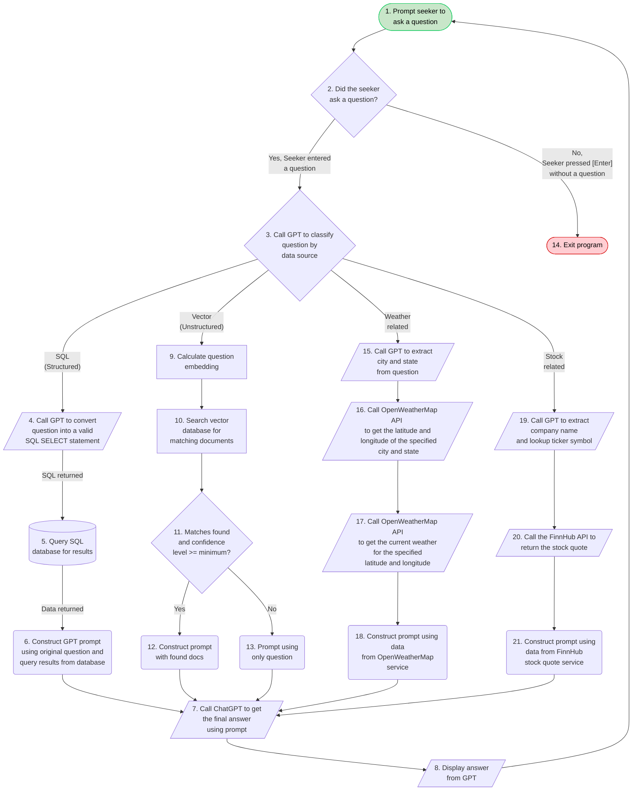

## Impactful Application Development | Process Automation | Artificial Intelligence | Agile Project Management | Technology Leadership | Business Intelligence

I am happy to collaborate with other developers working in the AI + ASP.NET + C# + SQL + vector database space. Am currently working on a series of articles on RAG. Providing consulting/contract services to clients around same. 

🔭 I’m currently working on a series of ASP.NET / C# / MVC projects to create a template AI question/answer chatbot using OpenAI's LLM and DataStax's vector database, along with other services and data sources.

<!--
**megerow/megerow** is a ✨ _special_ ✨ repository because its `README.md` (this file) appears on your GitHub profile.

Here are some ideas to get you started:

- 🔭 I’m currently working on ...
- 🌱 I’m currently learning ...
- 👯 I’m looking to collaborate on ...
- 🤔 I’m looking for help with ...
- 💬 Ask me about ...
- 📫 How to reach me: ...
- 😄 Pronouns: ...
- ⚡ Fun fact: ...
-->

The following flowchart depicts how this application functions. 

